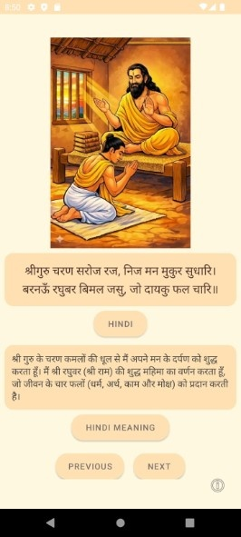
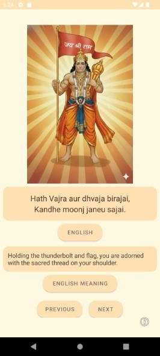
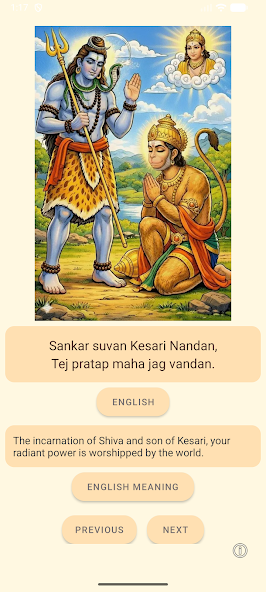

# 🙏📿 Hanuman Chalisa Chitralekha App

👇👇👇

<svg width="1200" height="160" viewBox="0 0 1200 160" xmlns="http://www.w3.org/2000/svg">
  <image src="hanumanjiFlying.png" width="120" height="120" y="20">
    <animateTransform
      attributeName="transform"
      type="translate"
      from="0 0"
      to="1200 0"
      dur="10s"
      fill="freeze"
    />
    <animate
      attributeName="opacity"
      from="1"
      to="0"
      begin="8s"
      dur="2s"
      fill="freeze"
    />
  </image>
</svg>

👆👆👆

Peaceful reading • Images • Multilingual

          OR

🔍 Search on Play Store:
### Hanuman Chalisa Chitralekha

– Read, See & Understand 📿

Experience the Hanuman Chalisa like never before with this beautiful App.

📖 Reading Mode

Read the Hanuman Chalisa at your own pace in a calm, distraction-free experience.
Each verse is displayed alongside beautifully illustrated images for better understanding and focus.

🌐 Multilingual Support

View verses, meanings, and transliterations in multiple languages:
Hindi, English, Marathi, Gujarati, Telugu, Tamil, Kannada, Malayalam, Bengali, Punjabi, and Odia.

🙏 Ideal for daily recitation, learning, and spiritual practice.

🙏 May Hanuman Ji bless you with strength and wisdom 🙏

### See some screenshots of this app:

  
  
  
  
  

### Created By
### Swapnil Bamble

